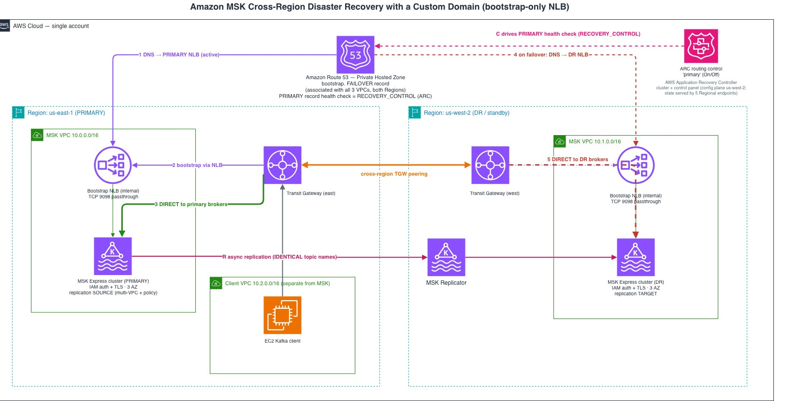

# Amazon MSK cross-region disaster recovery with a custom domain

This code sample deploys an active/standby disaster recovery (DR) architecture for
Amazon Managed Streaming for Apache Kafka (Amazon MSK) across two AWS Regions. It
creates two clusters with Express brokers on Amazon MSK and places them behind a
single bootstrap endpoint (`bootstrap.<domain>`). Amazon Route 53 resolves that
endpoint to the active Region. When you fail over, the endpoint switches to the
standby Region. Clients reconnect automatically without configuration changes.

You choose the two Regions with the `primary_region` and `dr_region` context keys.
This code sample defaults to `us-east-1` and `us-west-2`. AWS Transit Gateway
connects the client VPC to both cluster VPCs. MSK Replicator copies topics and
consumer offsets from the primary to the standby. A Kafka producer client in a
separate VPC runs throughout the demo so you can observe the cross-Region cutover in
real time.

The custom-domain pattern follows the bootstrap-only approach described in the
AWS Big Data Blog post
[Configure a custom domain name for your Amazon MSK cluster enabled with IAM authentication](https://aws.amazon.com/blogs/big-data/configure-a-custom-domain-name-for-your-amazon-msk-cluster-enabled-with-iam-authentication/).

> **Disclaimer:** This code sample is for demonstration and learning only. It
> deploys resources that incur cost in *two* AWS Regions (see [Cleanup](#cleanup)),
> and it is **not** production-ready infrastructure as code. Review, harden, and
> test it against your own security, availability, and operational requirements
> before you use any part of it in production.

## Architecture and how it works



*Editable source: [`docs/architecture.drawio`](docs/architecture.drawio) (open at [app.diagrams.net](https://app.diagrams.net)).*

The design keeps the Network Load Balancer out of the data path. It carries only
the bootstrap connection; after bootstrapping, clients connect directly to the
brokers over Transit Gateway. That is what makes failover transparent:

- Kafka clients reach the MSK brokers directly across Regions over Transit Gateway.
- The Network Load Balancer (NLB) terminates TLS on port 9098 for the bootstrap
  connection only. Its listener presents an ACM certificate for `bootstrap.<domain>`
  and re-encrypts to the brokers, so the client keeps TLS hostname verification on.
  There are no `advertised.listeners` changes.
- Route 53 puts a stable custom name (`bootstrap.<domain>`) in front of the two
  NLBs, using a failover record pair.
- Clients only ever configure `bootstrap.<domain>`, so failover is a DNS change
  with no client reconfiguration.

This bootstrap-only approach works unchanged with Express brokers on Amazon MSK,
which manage broker configuration and do not expose advertised listeners for
rewrite.

The data flow is identical at steady state and after failover:

1. The client resolves `bootstrap.<domain>` to the active Region's NLB.
2. It opens a TLS connection to the NLB, which presents the certificate for
   `bootstrap.<domain>`; the NLB re-encrypts to a broker and returns the brokers'
   *native* DNS names.
3. It connects directly to the brokers over Transit Gateway. The NLB is only in
   the bootstrap path, never the data path.

**Bootstrap certificate** - Because the sample uses a private domain
(`bootstrap.example.internal` by default), it cannot obtain a publicly trusted
certificate, so `scripts/gen_bootstrap_cert.sh` generates a self-signed
certificate for `bootstrap.<domain>` and imports it into AWS Certificate Manager
(ACM) in both Regions. `deploy.sh` runs this automatically. The EC2 client trusts
that certificate by adding it to a copy of the JVM default truststore (which
already trusts Amazon's public CA for the direct broker connections). This follows
the bootstrap-only pattern in the AWS Big Data Blog post cited above. For a domain
you own, request a public ACM certificate instead and skip the self-signed step.

By default, AWS Application Recovery Controller (ARC) routing controls drive
failover: an operator flips a single switch, and `bootstrap.<domain>` resolves to
the standby Region's NLB. The `simulate_primary_failure.sh` script applies three
levers together so the primary is genuinely cut off, not just DNS-repointed:

1. **Set the ARC routing control `primary` to Off.** The Route 53
   `RECOVERY_CONTROL` health check backing the primary failover record goes
   unhealthy, and `bootstrap.<domain>` resolves to the standby NLB within seconds.
2. **Add a stateless network ACL (NACL) `DENY` on tcp/9098** to the primary MSK
   subnets (rule number 90 by default, evaluated before the default allow rule).
   Because NACLs are stateless, this drops in-flight packets, not just new
   connections, severing the client's already-established direct broker sessions.
3. **Revoke the broker security group's tcp/9098 ingress.** This blocks new
   connections, fails the NLB health checks, and cuts the replicator's link.

At failover, a client's existing connections to the primary brokers are terminated,
and its next connection attempt times out until `bootstrap.<domain>` resolves to the
standby NLB and the client re-bootstraps against the standby cluster. In this code
sample, `run_load.sh` detects the Region change and reconnects automatically within
roughly 1–2 minutes; a plain Kafka client reconnects on its own retry schedule.
After failover, the client-to-broker path is cross-Region, so steady-state latency
increases. This is inherent to regional DR. The `failback.sh` script reverses all
three levers.

You can deploy without ARC (`-c use_arc=false`) to use fully automatic failover
driven by a `CLOUDWATCH_METRIC` health check on the primary NLB's
`HealthyHostCount`. In that mode there is no ARC cluster and no ARC hourly cost,
and levers 2 and 3 (which fail the NLB health check) trigger the flip.

### Limitation: source isolation depends on the source Region's control plane

Levers 2 and 3 isolate the primary cluster by changing network state in the
*source* Region (a network ACL entry and a security-group revoke). These are Amazon
EC2 control-plane calls in the failing Region, so a genuine large-scale regional
event can prevent them from completing. This is the same event you are failing away from.

Failover itself does **not** depend on that: the routing decision is the ARC routing
control or the Route 53 health check, and the failover records are pre-created, so
clients re-bootstrap onto the standby regardless of whether source isolation
succeeded. When isolation is skipped, the
result is a *split-brain window* rather than a failed failover. Clients with an
established session to the primary can keep writing to it until those sessions break,
and because replication is asynchronous those late writes join the stranded tail you
reconcile at recovery. A network ACL entry is the method used here; other
environments may isolate the source differently (for example, by changing Transit
Gateway, VPC, or AWS Direct Connect routing).

### AWS services used

- **Amazon MSK** (Express brokers on Amazon MSK, Kafka 3.6.0): the primary and
  standby clusters.
- **Amazon MSK Replicator**: cross-Region replication of topics and consumer
  offsets (primary to standby).
- **Amazon Route 53**: private hosted zone with a failover record pair for
  `bootstrap.<domain>`, plus the health check.
- **AWS Application Recovery Controller (ARC)**: routing controls for
  operator-driven failover (optional).
- **AWS Transit Gateway**: one per Region, peered cross-Region, connecting the
  client and MSK VPCs.
- **Elastic Load Balancing (Network Load Balancer)**: per-Region bootstrap
  endpoint; the TLS listener terminates the bootstrap connection.
- **AWS Certificate Manager (ACM)**: holds the imported self-signed certificate
  for `bootstrap.<domain>` that the NLB listener presents (one per Region).
- **Amazon EC2** and **AWS Systems Manager (Session Manager)**: the Kafka client
  instance and shell access to it.
- **Amazon VPC**: three non-overlapping VPCs (primary MSK, standby MSK, client).
- **Amazon CloudWatch**: the metric alarm used in the non-ARC failover mode.

The infrastructure is defined with the AWS Cloud Development Kit (AWS CDK) in
Python. `app.py` defines 10 stacks; cross-Region references are resolved with
`crossRegionReferences=True`.

| Stack | Region | Purpose |
|-------|--------|---------|
| `MskPrimaryCluster` | Primary | Primary MSK VPC, cluster (Express brokers), and bootstrap NLB. Replication source (multi-VPC connectivity and resource policy). |
| `MskDrCluster` | Standby | Standby MSK VPC, cluster (Express brokers), and bootstrap NLB. Replication target. |
| `MskClient` | Primary | Separate client VPC with an SSM-managed EC2 Kafka client. |
| `TgwPrimary` | Primary | Transit Gateway; attaches the client and primary MSK VPCs. |
| `TgwDr` | Standby | Transit Gateway; attaches the standby MSK VPC. |
| `TgwPeering` | Primary | Initiates the cross-Region TGW peering. |
| `TgwPeeringAccepter` | Standby | Accepts the peering (custom resource). |
| `MskRoutingControls` | Standby | ARC cluster, control panel, and the `primary` routing control. Omitted with `-c use_arc=false`. |
| `MskDnsFailover` | Primary | Route 53 cross-Region private zone, failover record, alarm, and health check. |
| `MskReplicator` | Standby | Cross-Region MSK Replicator (created in the target Region). |

## Prerequisites

- **One AWS account**, bootstrapped for AWS CDK in *both* Regions:
  ```bash
  cdk bootstrap aws://<ACCOUNT>/<primary-region> aws://<ACCOUNT>/<standby-region>
  ```
- **IAM permissions:** an AWS account with permissions to create and modify Amazon
  VPC (subnets, NAT gateways, route tables, security groups, network ACLs, and flow
  logs), AWS Transit Gateway (including cross-Region peering), Amazon MSK and MSK
  Replicator, Elastic Load Balancing (Network Load Balancer), Amazon Route 53
  (private hosted zone, records, and health checks), AWS Application Recovery
  Controller, AWS KMS, Amazon CloudWatch (alarms and log groups), AWS IAM (the
  service roles the stacks create), Amazon EC2, AWS Certificate Manager (importing
  and deleting the bootstrap certificate), and AWS Systems Manager resources.
  The sample deploys with AWS CDK, which also uses AWS CloudFormation and an Amazon
  S3 asset bucket. `deploy.sh` resolves the account from AWS STS unless you pass
  `--account`.
- **AWS CLI**, configured with credentials for the target account. `deploy.sh`,
  `destroy.sh`, and the post-deploy wiring scripts call it directly.
- **OpenSSL**, to generate the self-signed bootstrap certificate
  (`scripts/gen_bootstrap_cert.sh`, run automatically by `deploy.sh`).
- **AWS CDK CLI 2.1128.1 or later.** The synthesized cloud assembly uses schema 54;
  older CLIs fail with a "Cloud assembly schema version mismatch" error. Check with
  `cdk --version`.
- **Python 3** with the sample's dependencies:
  ```bash
  pip install -r requirements.txt
  ```
- **Express brokers on Amazon MSK and MSK Replicator** must be available in both
  Regions you choose (the defaults are `us-east-1` and `us-west-2`).

### Configuration

Configuration comes from AWS CDK context. Defaults are set in `cdk.json`; override
any key with `-c <key>=<value>`.

| Context key | Default | Description |
|-------------|---------|-------------|
| `domain_name` | `example.internal` | Custom domain for the private hosted zone and `bootstrap.<domain>`. |
| `cluster_name` | `msk-xregion-dr-demo` | Base name for the clusters and ARC resources. |
| `primary_region` | `us-east-1` | Primary Region. |
| `dr_region` | `us-west-2` | Standby Region. |
| `use_arc` | `true` | Set to `false` to use the CloudWatch-metric health check instead of ARC. |
| `skip_nag` | *(unset)* | Set to skip the cdk-nag `AwsSolutionsChecks` aspect. |

## Deployment

### Quick start (one command)

```bash
./deploy.sh
```

`deploy.sh` deploys the 10 stacks in order, waits for each prerequisite state
(cluster `ACTIVE`, peering `available`, and so on), runs the three post-deploy
wiring steps, and registers the broker targets on the client over SSM. It is
idempotent, so it is safe to re-run after a partial failure.

| Flag | Effect |
|------|--------|
| `--no-arc` | Deploy without ARC (alarm-only mode). |
| `--account <ID>` | Override the target account (default: resolved from AWS STS). |
| `--interactive` | Prompt for approval on each stack instead of `--require-approval never`. |

### Manual step-by-step

<details>
<summary>Expand the manual deployment steps</summary>

Order matters because of the cross-Region peering and the post-deploy wiring.

```bash
export CDK_DEFAULT_ACCOUNT=<your-account-id>

# 0a. Bootstrap TLS certificate. Generate the self-signed certificate and import
#     it into ACM in both Regions, then pass the per-Region ARNs to EVERY cdk
#     deploy below (the cluster stacks' NLB listeners reference them). Without
#     these context keys the NLB falls back to TCP passthrough.
scripts/gen_bootstrap_cert.sh
source certs/cert-arns.env
CERT_CTX="-c primary_cert_arn=$PRIMARY_CERT_ARN -c dr_cert_arn=$DR_CERT_ARN"

# 0b. ARC routing controls (standby Region). Deploy FIRST so the DNS + client stacks
#    can reference the primary routing-control ARN. Skip with -c use_arc=false.
cdk deploy MskRoutingControls $CERT_CTX
#    New routing controls default to Off. Set the primary control On (steady
#    state) BEFORE the DNS health check points at it, or DNS will read the
#    primary as unhealthy and fail over immediately:
scripts/set_routing_control.sh --state On

# 1. Clusters (both regions) + client VPC. The cluster NLB listeners need the
#    certificate ARNs; pass $CERT_CTX to every cdk deploy so the context is
#    consistent across the app.
cdk deploy MskPrimaryCluster MskDrCluster MskClient $CERT_CTX

# 2. Transit Gateways, then peering, then acceptance
cdk deploy TgwPrimary TgwDr $CERT_CTX
cdk deploy TgwPeering $CERT_CTX
cdk deploy TgwPeeringAccepter $CERT_CTX

# 3. TGW route-table routes via the peering (must be 'available' first)
scripts/wire_tgw_routes.sh

# 4. DNS/failover
cdk deploy MskDnsFailover $CERT_CTX

# 5. Prepare the PRIMARY cluster as a cross-region replication SOURCE.
#    MSK only allows enabling multi-VPC auth after a cluster is created, so this
#    is a post-deploy step: it turns on SASL/IAM multi-VPC connectivity and
#    attaches the Replicator resource policy. Run after the cluster is ACTIVE.
scripts/enable_source_multivpc.sh
#    Wait for the primary cluster to return to ACTIVE (it goes UPDATING briefly).

# 6. The cross-region replicator (now that the source is ready)
cdk deploy MskReplicator $CERT_CTX
```

After the clusters are `ACTIVE`, register each cluster's brokers with its NLB
target group. Run this from the EC2 client over SSM, so the broker DNS resolves to
private IPs reachable over Transit Gateway:
</details>

```bash
# on the client (Session Manager): bash -l
/opt/kafka/register_broker_targets.sh --cluster primary
/opt/kafka/register_broker_targets.sh --cluster dr
```

## Usage

Connect to the client with SSM Session Manager, then run `bash -l`. The scripts are
in `/opt/kafka`. EC2 user-data exports the required environment variables (broker
security group ID, Region, and routing-control ARNs) in `/etc/profile.d/kafka.sh`;
each script also accepts equivalent flags.

The `deploy.sh` output prints the exact connect command for your client instance.
It has this form:

```bash
aws ssm start-session --region <primary-region> --target <client-instance-id>
```

### Walk through a failover

Open four panes on the client and run one command in each:

```bash
# Pane 1 - continuous producer + consumer against the custom domain
./run_load.sh --mode both

# Pane 2 - live failover dashboard (alarm / health check / which Region DNS points to)
./watch_failover.sh

# Pane 3 - trigger the failover (ARC primary->Off + NACL DENY + SG revoke)
./simulate_primary_failure.sh
#   ... watch bootstrap.<domain> flip from PRIMARY to DR;
#       the consumer freezes, then resumes on the DR cluster. Because the NACL
#       DENY is stateless, the producer's existing sessions to the primary are
#       cut immediately, not just its new connections.

# Pane 4 - restore the primary (reverses all three levers)
./failback.sh
```

You can also drive ARC directly, without the security-group and NACL levers:

```bash
./set_routing_control.sh --state Off   # fail over to DR
./set_routing_control.sh               # print current state
./set_routing_control.sh --state On    # return to PRIMARY
```

To prove the client actually switched clusters, compare the brokers it connects to
before and after failover (run it after the client re-bootstraps, post-TTL):

```bash
kafka-broker-api-versions.sh \
  --bootstrap-server bootstrap.<domain>:9098 \
  --command-config /opt/kafka/client-iam.properties | head
```

Before failover the hostnames belong to the primary cluster; after, to the
standby cluster.

### Scripts

The runtime demo scripts (`run_load.sh`, `watch_failover.sh`,
`simulate_primary_failure.sh`, `failback.sh`, `set_routing_control.sh`,
`register_broker_targets.sh`) run on the EC2 client and read their configuration
from environment variables set by user-data, with flag overrides. The deploy-time
scripts (`gen_bootstrap_cert.sh`, `wire_tgw_routes.sh`, `enable_source_multivpc.sh`)
run on your workstation as part of `deploy.sh`.

| Script | Purpose |
|--------|---------|
| `run_load.sh` | Runs a producer and/or consumer against `bootstrap.<domain>`. `--mode producer` emits one numbered message per second; `--mode consumer` prints messages with a running count; `--mode both` (default) runs both. |
| `watch_failover.sh` | Dashboard: ARC routing-control state, primary NLB alarm, Route 53 health check, and which Region `bootstrap.<domain>` resolves to. |
| `simulate_primary_failure.sh` | Triggers failover with all three levers (ARC → Off, NACL DENY, SG revoke). |
| `failback.sh` | Reverses all three levers and returns traffic to the primary. |
| `set_routing_control.sh` | Reads (no args) or sets (`--state On\|Off`) the primary ARC routing control. |
| `register_broker_targets.sh` | Registers a cluster's brokers with its NLB target group (`--cluster primary\|dr`). |
| `enable_source_multivpc.sh` | Enables multi-VPC IAM connectivity and the Replicator resource policy on the primary cluster (post-deploy). |
| `wire_tgw_routes.sh` | Adds the cross-Region Transit Gateway route-table routes over the peering. |
| `gen_bootstrap_cert.sh` | Generates the self-signed `bootstrap.<domain>` certificate and imports it into ACM in both Regions (run by `deploy.sh`; runs on the workstation, not the client). |

### A note on cross-Region IAM authentication

IAM authentication for MSK uses SigV4, which includes the AWS Region in the signed
request. The `aws-msk-iam-auth` client derives that Region from the bootstrap
hostname. A Region-less name such as `bootstrap.example.internal` causes the client
to fall back to its default Region, which matches only one of the two clusters. You
must therefore supply the Region explicitly when using a single custom domain
across Regions. This sample sets the Region per connection: `run_load.sh` detects
which Region's NLB `bootstrap.<domain>` currently resolves to and exports
`AWS_REGION` accordingly, so after a failover the next reconnect re-detects the
active Region. This applies to IAM only, not to SASL/SCRAM.

## Cleanup

This sample creates resources that incur hourly charges in *two* AWS Regions,
including clusters that use Express brokers on Amazon MSK and (by default) an ARC
cluster. Tear everything down
when you finish to avoid ongoing charges.

```bash
./destroy.sh            # prompts for confirmation
./destroy.sh --force    # skip the confirmation prompt
```

`destroy.sh` deletes the stacks in reverse dependency order: Replicator and DNS
first, then networking (peering, then Transit Gateways), then the client and
clusters, and finally the ARC routing controls. It then deletes the imported
bootstrap certificates from ACM (after the NLB listeners that reference them are
gone).

To destroy manually:

```bash
cdk destroy MskReplicator MskDnsFailover
cdk destroy TgwPeeringAccepter TgwPeering TgwDr TgwPrimary
cdk destroy MskClient MskDrCluster MskPrimaryCluster
cdk destroy MskRoutingControls   # stops the ARC cluster's hourly charge

# Delete the imported bootstrap certificates once the NLB listeners are gone.
# ACM refuses to delete a certificate still associated with a listener.
for r in <primary-region> <standby-region>; do
  arn=$(aws acm list-certificates --region "$r" \
    --query "CertificateSummaryList[?DomainName=='bootstrap.<domain>'].CertificateArn | [0]" \
    --output text)
  [ "$arn" != "None" ] && aws acm delete-certificate --region "$r" --certificate-arn "$arn"
done
```

Notes:

- The ARC cluster (`MskRoutingControls`) bills continuously whether or not you have
  failed over, so it is the one piece you do not want to leave running.
- The Transit Gateway peering may need a moment to delete before the Transit
  Gateways will. If a destroy stalls on a dependency, retry after the peering
  attachment is fully removed.

## Security

See [CONTRIBUTING](CONTRIBUTING.md#security-issue-notifications) for more information.

## Contributing

Contributions are welcome. Please read [CONTRIBUTING.md](CONTRIBUTING.md) before
opening an issue or pull request.

## License

This sample is licensed under the MIT No Attribution license (MIT-0). See the
[LICENSE](LICENSE) file.
